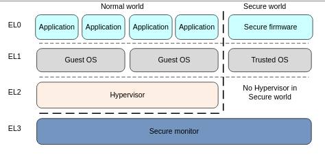

## Hello Interrupts

In this folder, we continue the hello peripherals program and extend it with interrupts.

To understand interrupts, we have to go through with exceptions first, as it requires elaborate
discussion, I refer to the original <a href="https://developer.arm.com/documentation/den0024/a/Introduction" class="custom-link">ARM documentation page</a>
which is more practical than the ARMv8 reference manual (really big!).

As we know, *Ras pi 3b plus* has Broadcom 2837 a cortex A57 A profile ARM processor, based on  ARMv8 architecture.

As you see, the armv8-based architecture has 4 levels of exceptions.

- EL0: For normal user-level applications (like user-level applications in Linux) (least privileged)
- EL1: Operating System (Linux kernel, root user)
- EL2: a single exception level called Hypervisor that provides virtualization services if it is enabled.
- Low-level firmware, including the secure monitor.

It is ideal to develop our *OS* tutorial in EL1 level, as you see, we are not developing software that accommodates multiple *OS* kernel services.
Also, we are not monitoring the service, rather we are in the direction of developing a bare metal *OS*.

Compared to earlier hello UART0, UART1, and peripherals folder, here we have to change our start.S assembly file to switch into
level *EL1* from *EL2*. To switch from *EL2* to *EL1*, we will get to know a few register types.

There are 31 general-purpose registers named *X0, X1,...X30* (62-bit width), the same registers can be used as 32-bit width,
if we refer to them as *W0, W1,...W30*. These registers are common for all four exception levels (or execution levels).

There are also several special registers.

Zero register *XZR/WZR*  (for 62 and 32 bits mode respectively), and program counter *PC* are common for all four levels.

There is a Stack pointer *SP_ELn*, where n= 0,1,2 or 3 for each exception level (*WSP_ELn* for 32 bit mode). 
In the program when we refer *SP*, it refers to the current exception level stack pointer register by default.
Level *EL0* can only refer to *SP_EL0*. 

There is also a Exception link register *ELR_ELn* (holds exception return address) and 
Saved Process Status Register *SPSR_ELn* (holds the value of PSTATE before taking an exception, 
and it is used to restore the PSTATE value that map to the exception level, by storing the PSTATE before taking an exception) for n= 1, 2 or 3.

I.e *ELR_ELn* store the return address to return from new exception level, but it does not know to what 
exception level it should go back, that information stored in the *SPSR* register. 
-	*SPSR_EL*[3:0] holds PSTATE, 5 refers to level 1, 12 refers to level 3, 8 refers to level 2
-	*SPSR_EL*[4] 0 indicates aarch64, otherwise it is *aarch32*.

There are number of System registers notably our *SPSR_ELn*, *ELR*, and many others, we point some registers that we will use in near future
namely Vector Based Address Register*VBAR_ELn* for n = 1, 2 and 3 holds the exception base address for any exception that is taken to ELn,
*CNTFRQ_EL0* Counter-timer Frequency Register reports the frequncy of the system timer,
*CNTPCT_EL0* Counter-timer Physical Count Register holds the 64-bit current count value,
*CNTKCTL_EL1* Counter-timer Kernel Control Register controls the generation of an event stream from the virtual counter, and many more.

These system registers are very important concept we have to look thoroughly, when we start decent *OS* kernel development. 

## AArch64 exception-Interrupt table

When an exception interrupt occurs, the processor must execute handler code which corresponds to the exception. 
The location in memory where the handler is stored is called the exception vector (or interrupt vector). 
In the ARM architecture, exception vectors are stored in a table, called the exception vector table. 
Each Exception level has its own vector table, that is, there is one for each of *EL3*, *EL2* and *EL1*. 

The table contains instructions to be executed, rather than a set of addresses. 
Vectors for individual exceptions are located at fixed offsets from the beginning of the table. 
The virtual address of each table base is set by the Vector Based Address Registers *VBAR_EL3*, *VBAR_EL2* and *VBAR_EL1*.

In order write the system based interrupt for counter or delay instead of polling type we have to use these *VBAR_EL1*. 

## Vector Table Offsets
address with offset   |     Exception Interrupts  |         Description          
----------------------|---------------------------|---------------------------------
*VBAR_ELn + 0x000*    |    Synchronous            |         *SP_EL0*
*+ 0x080*             |     IRQ                   |  The exception is taken from *EL1*  
*+ 0x100*             |     FIQ                   |   but *EL1, EL0* shares the stack pointer *SP0*
*+ 0x180*             |     SError                |      
----------------------|---------------------------|---------------------------------
----------------------|---------------------------|---------------------------------
*+ 0x200*             |    Synchronous            |            *SP_EL1*
*+ 0x280*             |     IRQ                   |   The exception is take from *EL1*
*+ 0x300*             |     FIQ                   |			but *EL1, EL2* using their own stack pointer registers
*+ 0x380*             |     SError                |				*SP_EL0, SP_EL1*
----------------------|---------------------------|----------------------------------
----------------------|---------------------------|----------------------------------
*+ 0x400*             |    Synchronous            |   *SP_EL0* using AARCH64 mode
*+ 0x480*             |     IRQ                   |			Exception is taken from *EL0*
*+ 0x500*             |     FIQ                   |			that executes in 64-bit mode
*+ 0x580*             |     SError                |
----------------------|---------------------------|----------------------------------
----------------------|---------------------------|----------------------------------
*+ 0x600*             |    Synchronous            |   *SP_EL0* using AARCH32 mode
*+ 0x680*             |     IRQ                   |			Exception is taken from *EL0*
*+ 0x700*             |     FIQ                   |     that executes in 32-bit mode
*+ 0x780*             |     SError                |
----------------------|---------------------------|----------------------------------

-	The type of exception (SError, FIQ, IRQ or Synchronous).

-	If the exception is being taken at the same Exception level, the Stack Pointer to be used can vary, its either *SP_EL0* or *SP_EL1*, depends on how we set the 
saved processor status register.

- If the exception is being taken at a lower Exception level i.e , the execution state of the next lower level (AArch64 or AArch32)

